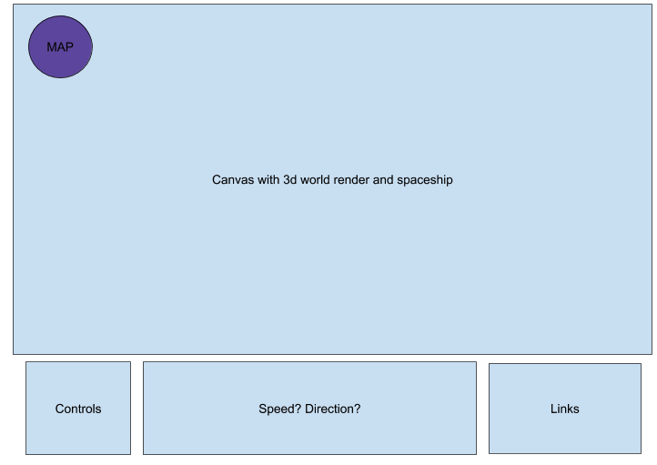

# Background and Overview
I want to make a first person view obstacle game. The look will be similar to minecraft. The goal of the game will be to collect as many sentinel points as you can without getting hit as well as moving from obstacle to obstacle until the end. Like mario.

# Functionality and MVP

Users will begin on the ground level with limited amount of orbs to shoot. There will be two sentinels, one yellow glowing that will be collected for points, and the other red that will be faster that will hurt you if you get git by them, also will subtract from points, and also knock you off of the obstacle you are on. Once a user has enough points a "stair case" will apear to bring them to the next level with holes. If they fall through the holes, they start back at level 1, if they are able to gain enough points the next staircase will apear to the next harder level.

# File Structure:

* /dist 

* Index.html
* .gitignore
* node_modules
* package.json
* package.lock.json
* postcss.config.js
* README.md
* webpack.common.js
* webpack.dev.js
* Webpack.prod.js

* /src/
	* images/
		* 3d models if any
		* Music if any
		* Textures
	* index.js
	* js
		* scene
		* ammo
		* objects
		* environment
    
# Wire Frame

# Architecture and Technology

My project is going to rely heavily on three.js and javascript. The bulk of the rendering will be done with three.js. Javascript will be used to create the UI and conditionals of exploration and game like feature.

# Timeline

### Monday - 10/12/20
Set up three.js, make basic moving ball action, which will eventually become the spaceship using keydown listeners. Make physics of movement fluid.

### Tuesday - 10/13/20
Start mapping 3d space with objects. Point Lock Controls, make first couple obsticles.

### Wednesday - 10/14/20
Try to implement the crahsing and shooting aspects of exploration. Make the animations for sentinels and lighting for the world.

### Thursday - 10/15/20
Polish up looks, keep trying to implement collision and shooting.

